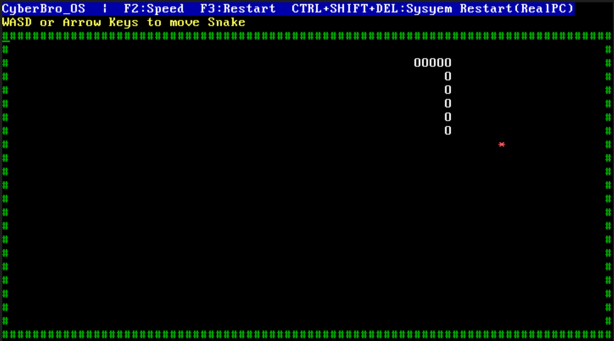

# 🐍 CyberBroOS (CyberSnakeOS)

**CyberBroOS** — bu C va Assembly’da yozilgan minimal experimental Operating System bo‘lib, ichida Snake o‘yini ishlaydi.  
Loyiha — OS development, low-level programming va kernel asoslarini amaliy o‘rganish maqsadida yaratilgan.

> "Build your own OS to truly understand computers." — CyberBro

---

## 🎯 Loyihaning maqsadi

Minimal OS yaratishdan asosiy maqsad:

- Bootloader va kernel qanday ishlashini tushunish
- Real hardware bilan bevosita ishlash
- VGA text-mode grafikasi bilan ishlash
- Keyboard interrupt handling o‘rganish
- OS architecture va low-level cybersecurity bilimlarini mustahkamlash

Bu loyiha keyinchalik **CyberBroOS** nomli advanced security-focused custom OS yaratish yo‘lidagi birinchi bosqich hisoblanadi.

---

## 🖥️ OS nima qiladi?

Hozirgi versiyada:

- Custom bootloader ishga tushadi  
- Kernel yuklanadi  
- VGA text-mode ekran chiqaradi  
- Klaviatura input orqali Snake o‘yini boshqariladi  
- Game over va restart funksiyasi mavjud  
- F2 orqali tezlikni o‘zgartirish  
- F3 orqali o‘yinni restart qilish  

Ya’ni bu — **to‘liq standalone ishlaydigan bare-metal OS ichidagi Snake game**.

---

## 🎮 Boshqaruv (Usage)

| Tugma | Amal |
|--------|------|
| W / ↑ | Yuqoriga yurish |
| S / ↓ | Pastga yurish |
| A / ← | Chapga yurish |
| D / → | O‘ngga yurish |
| F2 | Snake tezligini o‘zgartirish |
| F3 | O‘yinni qayta boshlash |
| CTRL + SHIFT + DEL | Real PC’da sistemani restart qilish |

---

## 📸 Screenshotlar

### Boot ekrani


### Welcome screen


### O‘yin jarayoni


### Game Over


---

## ⚙️ Build qilish

### Talablar:

- Linux yoki WSL
- `nasm`
- `gcc` cross-compiler (`i686-elf-gcc`)
- `ld`
- `qemu` (test qilish uchun)

### Build:

```bash
git clone https://github.com/shohruhyuldashev/SnakeGameOS.git
cd SnakeGameOS
bash build.sh
